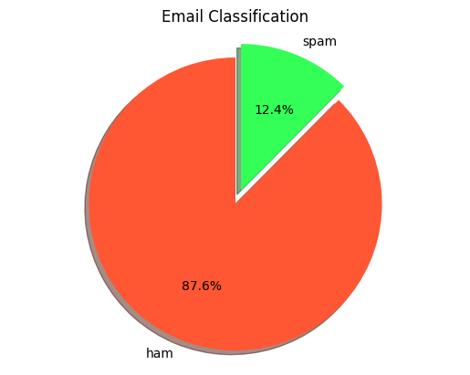
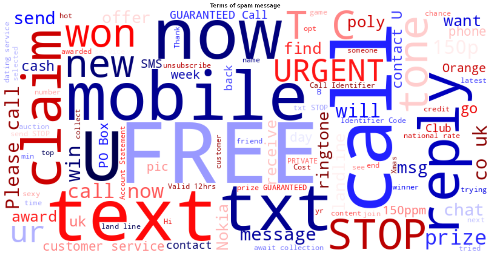
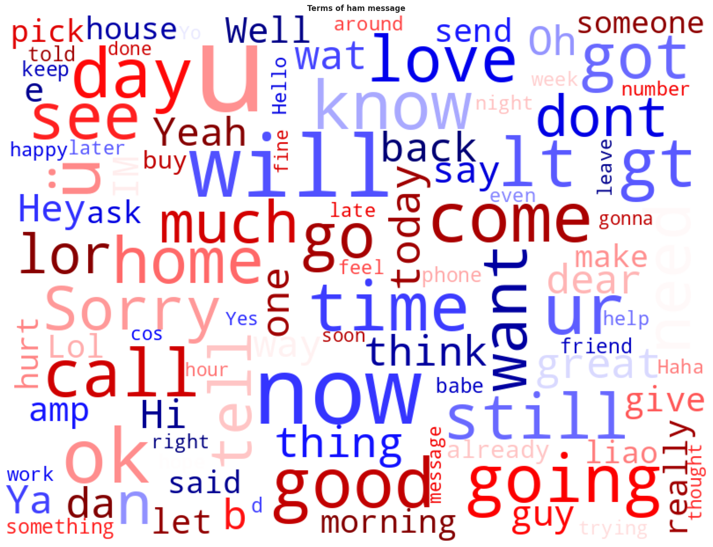

# 📧 Spam Email Classification with Deep Learning + IBM Granite

## 📌 Overview
This project focuses on **spam email classification** using deep learning.  
The workflow includes data preprocessing, feature engineering, exploratory data analysis (EDA), and model training.  

To accelerate the workflow, **IBM Granite AI** was integrated. With prompt-based interactions, Granite supports tasks such as data exploration, visualization, and dataset balancing — replacing many manual steps with natural language commands.  

👉 **Run on Google Colab:** [Open Notebook](<https://colab.research.google.com/drive/18mtR3RQPIKi4UpCi5bCmhnZ6c9pzQUiV?usp=sharing>)

---

## 📂 Dataset
- Source: [Spam Email Dataset](<https://www.kaggle.com/datasets/mfaisalqureshi/spam-email>)  
- Size: ~5.5k messages  
- Columns:  
  - `category`: spam or ham  
  - `message`: the raw text message  

---

## 🔎 Analysis Process
1. **Data Loading & Cleaning**  
   - Removed duplicates and missing values.  
   - Standardized column names.  

2. **Exploratory Data Analysis (EDA)**  
   - Distribution of spam vs ham.  
   - Histogram of number of characters and words.  
   - WordClouds for spam and ham messages.  

3. **Balancing Dataset**  
   - Undersampled majority class (ham) to match spam count.  

4. **Modeling**  
   - Deep learning model for classification.  
   - Evaluation with accuracy and other metrics.  

---

## 📊 Insight & Findings
- Dataset was imbalanced: ~87% ham vs 13% spam.  
- Spam messages often contain promotional keywords, numbers, and shorter phrasing.  
- WordClouds clearly differentiate the frequent terms used in spam vs ham.  
- Balancing the dataset improved the model’s ability to detect spam messages.  

  
*Pie chart showing proportion of spam vs ham messages*

  
*Most frequent terms in spam messages*

  
*Most frequent terms in ham messages*

---

## 🤖 AI Support (IBM Granite)
IBM Granite was integrated to:  
- Query the dataset using prompts instead of coding (`"Show me the first 5 rows of the dataset"`).  
- Visualize data (histograms, pie charts, wordclouds) through natural language instructions.  
- Automate resampling for dataset balancing.  

This reduced the coding effort and made the workflow faster and more intuitive.  

---

## 📝 Example Granite Prompts
- `"Show the count of each label in the 'category' column."`  
- `"Create a histogram that compares the distribution of 'num_words' for spam and ham."`  
- `"Undersample the majority class so that the dataset is balanced and save it back into variable df."`  
- `"Generate a WordCloud for spam messages using the 'transformed_text' column."`  

---

## 🚀 How to Run
1. Open the notebook in Google Collab.  
2. Mount Google Drive (if dataset is stored in Drive).  
3. Run cells sequentially to reproduce the analysis.  
4. Modify prompts to explore dataset with IBM Granite AI.  

---

## 📌 Project Info
- Author: Muhammad Endrico 
- Tools: Python, Scikit-learn, Seaborn, Matplotlib, WordCloud, IBM Granite AI  
- Part of Hacktiv8 x IBM SkillsBuild Capstone Project  
